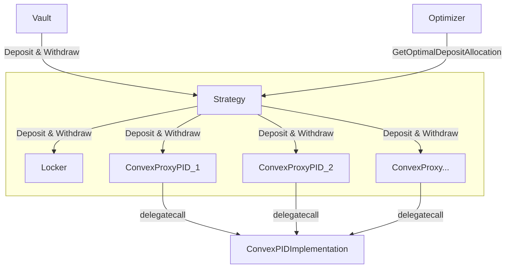

# <h1 align="center">Only Boost</h1>

This repository contains the implementation of the OnlyBoost white paper, focusing on smart contracts for the CRV Liquid Locker. These contracts optimize the fund distribution between Stake DAO and Convex to maximize the boost.

## Installation

Install Foundry:
```bash
   # This will install Foundryup
   curl -L https://foundry.paradigm.xyz | bash
   # Then Run
   foundryup
```

Install Dependencies:
```bash
    forge install
```

Build:
```bash
    forge b
```

Run all tests:
```bash
    make test
```
    
## Architecture

### Deposit and Withdrawal Flow



### Claim Rewards

## Acknowledgements
