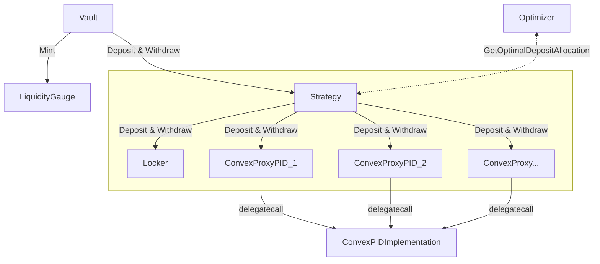
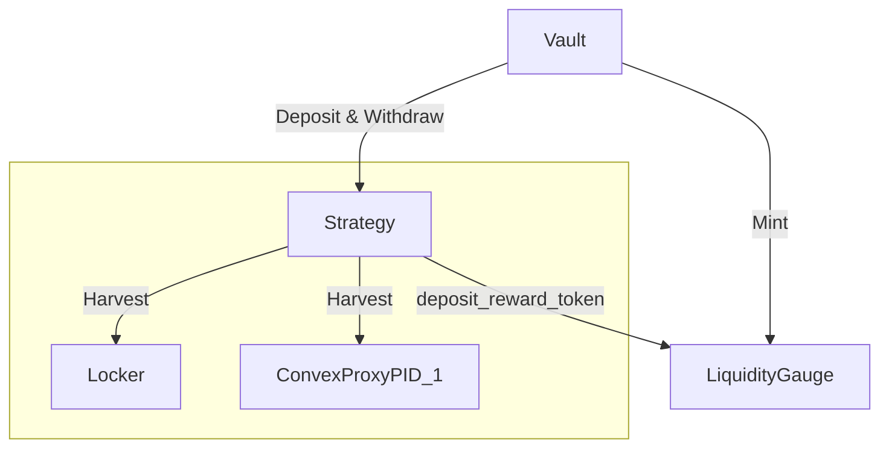

# <h1 align="center">Only Boost</h1>

This repository contains the implementation of the OnlyBoost white paper, focusing on smart contracts for the CRV Liquid Locker. These contracts optimize the fund distribution between Stake DAO and Convex to maximize the boost.

## Installation
    
## Architecture

### Locker

The `locker` contract serves as a repository for both the `voting power` and `boosting power` inherent to the underlying protocol. Acting as a proxy for the end user, it retains any deposits with the goal of enhancing their returns.

### Strategy

Serving as the central access point to the `locker`, the `strategy` contract establishes a bridge for interaction. This contract facilitates the movement of funds between the `users` and the `locker`, undertakes the task of harvesting rewards, and ensures their appropriate distribution. 

Additionally, third-party contracts, referred to as plugin contracts, can also interface with the `strategy` contract for various functions, including voting.

### Optimizer

The `optimizer` contract's responsibility is to determine the most advantageous allocation of deposits between Convex and Stake DAO. By referencing the Convex Minimal Proxy Factory, it identifies the relevant Convex addresses; however, if none are found, all allocations are directed towards Stake DAO

### Convex Minimal Proxy

For each Convex pool, there's a dedicated minimal proxy that is deployed through a factory system. Given that any participant can stake a claim for a user on Convex, this architecture not only simplifies the reward distribution process but also results in a reduction of gas costs.

## Flow
### Deposit and Withdrawal Flow

### Harvest Rewards Flow

Per PID & Token:

## Acknowledgements
